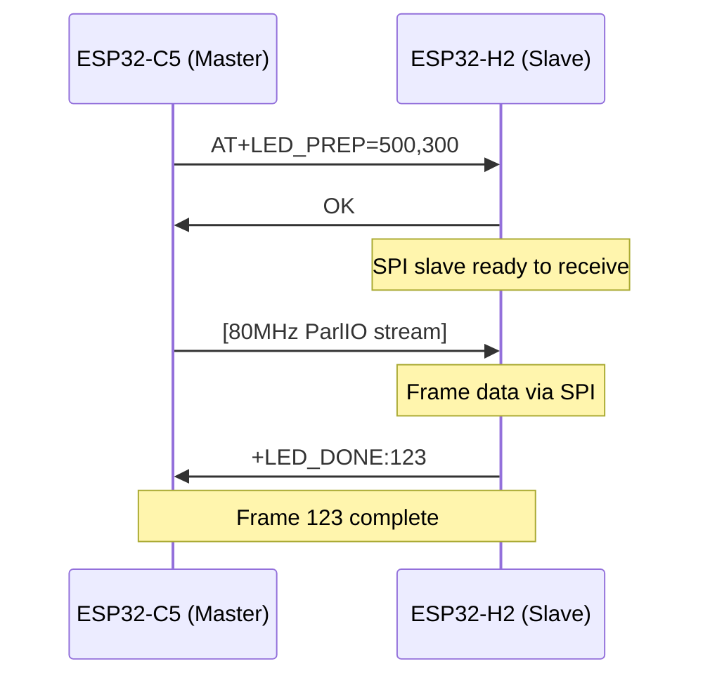
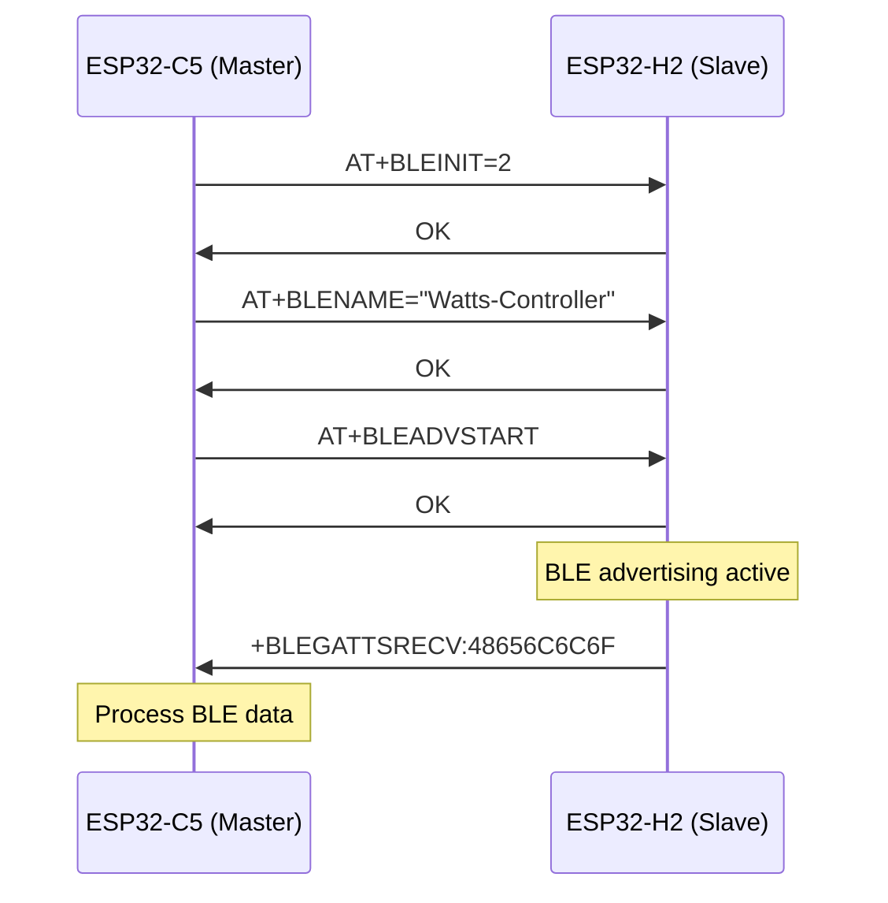

# AT Command Protocol

The AT Command Protocol serves as the primary communication mechanism between the ESP32-C5 (master) and ESP32-H2 (slave) in the Watts v3 dual-MCU lighting system. This protocol enables configuration synchronization, LED frame coordination, BLE management, and firmware updates.

## Protocol Architecture

### Communication Channel
- **Physical Layer**: UART (5 Mbaud, 8N1)
- **Flow Control**: Hardware CTS/RTS enabled
- **Direction**: Bidirectional with master-slave relationship
- **Framework**: Tiny-CAT AT command parser on ESP32-H2

### Message Types

#### 1. AT Commands (C5 → H2)
Standard AT command format sent by the master controller:
```
AT+COMMAND[=param1[,param2[,...]]]
```

#### 2. Responses (H2 → C5)  
Standard response patterns from the slave device:
```
OK              # Success
ERROR           # Command failed
+DATA:value     # Data response
```

#### 3. Unsolicited Result Codes - URCs (H2 → C5)
Asynchronous notifications from slave to master:
```
+LED_DONE:frame_id      # Frame processing complete
+BLEGATTSRECV:data      # BLE data received
+ERROR:code             # Error notification
```

## Communication Flow

### LED Frame Synchronization
The most critical protocol operation coordinates LED frame rendering across both MCUs:



### BLE Configuration Flow
BLE setup and management through AT commands:



## Command Categories

### Configuration Commands
Commands for system initialization and setup:
- **AT+BLEINIT**: Initialize BLE stack
- **AT+BLENAME**: Set device name
- **AT+RST**: System restart

### LED Control Commands  
High-speed LED frame coordination:
- **AT+LED_PREP**: Prepare frame reception
- **AT+LED_STATS**: Get statistics
- **AT+LED_RESET**: Reset controller

### BLE Operations
Bluetooth Low Energy management:
- **AT+BLEADVSTART/STOP**: Advertising control
- **AT+BLESVC/CHAR**: Service/characteristic queries
- **AT+BLEREAD/WRITE**: Data operations

### Maintenance Commands
System maintenance and updates:
- **AT+OTAUPDATE**: Firmware update
- **AT+XSET**: Debug/test operations

## Error Handling

### Response Codes
| Response | Meaning | Action |
|----------|---------|---------|
| `OK` | Command succeeded | Continue operation |
| `ERROR` | Command failed | Retry or fallback |
| `HOLD` | Command processing | Wait for completion |

### Timeout Management
- **Standard Commands**: 1000ms timeout
- **LED_PREP**: 100ms timeout (time-critical)
- **OTA Operations**: 30000ms timeout
- **BLE Operations**: 5000ms timeout

### Error Recovery
1. **Command Timeout**: Retry up to 3 times
2. **UART Errors**: Reset communication channel
3. **Frame Sync Loss**: Send `AT+LED_RESET`
4. **BLE Errors**: Reinitialize BLE stack

## Performance Characteristics

### Throughput
- **Command Rate**: ~1000 commands/second
- **LED Frame Rate**: Up to 60 FPS with sub-5µs coordination
- **BLE Latency**: <50ms for characteristic operations

### Reliability Features
- **CRC Protection**: Frame data integrity
- **Acknowledgment**: Positive confirmation required
- **Flow Control**: Hardware-level congestion management
- **Automatic Retry**: Built-in error recovery

## Integration Points

### C5 Implementation (ATHost)
```cpp
// Send LED preparation command
bool result = ATHost_sendATWaitOK("AT+LED_PREP=500,300", 100);

// Wait for frame completion
if (ATHost_waitLedDone(50)) {
    // Frame processed successfully
}
```

### H2 Implementation (Tiny-CAT)
```c
// Command handler registration
at_cmd_t led_prep_cmd = {
    .name = "LED_PREP",
    .run = at_cmd_led_prep_spi,
    .set = at_cmd_led_prep_spi
};
```

### WLED Integration
The protocol integrates seamlessly with WLED through the NeoPixelBus framework:
```cpp
// Automatic AT command integration
snprintf(cmd, sizeof(cmd), "AT+LED_PREP=%d,%d", ch2_pixels, ch3_pixels);
ATHost_sendATWaitOK(cmd, 100);
```

## Protocol Extensions

The AT command framework supports easy extension for new functionality:

1. **Register New Commands**: Add handlers to appropriate category files
2. **Define Response Format**: Follow established patterns
3. **Implement Host Methods**: Add corresponding ATHost functions
4. **Update Documentation**: Include in API reference

This extensible design allows the protocol to grow with system requirements while maintaining backward compatibility and performance characteristics.

## Next Steps

For detailed command syntax and parameters, see the [AT Command API Reference](/api-reference/at-commands/overview). For implementation examples, refer to the ESP32-C5 and ESP32-H2 specific firmware documentation.